# ClawCraft-bot

Secure Minecraft bot with a high-level API for control via OpenClaw.

## Quick Start

```bash
# 1. Installation
npm install

# 2. Setup (copy and edit)
cp .env.example .env
# Edit .env: MC_HOST, MC_PORT, MC_USERNAME

# 3. Run
npm start
```

## API

Bridge API is available at `http://127.0.0.1:3001` (default).

### Read Data (GET)

| Endpoint | Description |
|----------|-------------|
| `/health` | Bridge status (always available) |
| `/status` | Health, food, position, gameMode |
| `/position` | Bot coordinates |
| `/inventory` | Items in inventory |
| `/nearby?radius=32` | Nearby entities (default radius 32) |
| `/scan-blocks?radius=8` | Scan nearby blocks (default radius 8) |
| `/findblock?name=oak_log&maxDistance=32` | Find specific block by name |

### Actions (POST)

| Endpoint | Body | Description |
|----------|------|-------------|
| `/actions/goto` | `{ x, y, z }` | Navigate to coordinates |
| `/actions/follow` | `{ player, distance? }` | Follow a player |
| `/actions/chat` | `{ message }` | Send message to global chat |
| `/actions/whisper` | `{ player, message }` | Send private message |
| `/actions/stop` | — | Stop everything (tasks and movement) |
| `/actions/dig` | `{ name }` or `{ x, y, z }` | Dig block (by name or coordinates) |
| `/actions/collect` | `{ name, count?, maxDistance? }` | Dig and COLLECT blocks (default 1 pc) |
| `/actions/activate-block`| `{ x, y, z }` | Click/open/use block |
| `/actions/craft` | `{ name, count, useCraftingTable? }` | Craft an item |
| `/actions/equip` | `{ name, destination? }` | Hold/equip item (`hand`, `head`, `torso`, `legs`, `feet`, `off-hand`) |
| `/actions/unequip` | `{ destination }` | Remove item from specified slot |
| `/actions/toss` | `{ name, count? }` | Drop item from inventory |
| `/actions/consume` | — | Eat or drink item in hand |
| `/actions/place-block` | `{ x, y, z, name }` | Place block in the world (face calculated automatically) |
| `/actions/build-house` | `{ material? }` | Build a small 5x5 starter house (default: oak_planks) |
| `/actions/hotbar` | `{ slot }` | Switch active hotbar slot (0-8) |
| `/actions/attack` | `{ name?, id? }` | Attack entity |
| `/actions/protect` | `{ player }` | Protect player |
| `/actions/creative` | `{ name, count?, slot? }` | Get item (Creative mode only) |

### Jobs (GET)

| Endpoint | Description |
|----------|-------------|
| `/jobs/:id` | Job status (pending/running/done/failed/cancelled) |

## Safety & Instincts

The bot has a **Safety Manager** that runs autonomous "instincts" in the background. These behaviors can interrupt active jobs if necessary:

- **Panic Mode (Retreat)**: Activates when health <= 6 HP (3 hearts). The bot cancels all tasks, notifies the chat, and runs away from threats for 10 seconds.
- **Auto-Defend (Retaliate)**: If attacked while performing a non-combat task (digging, building, etc.), the bot will cancel the task and counter-attack the aggressor.
- **Auto-Eat**: If hunger is low (< 14) and the bot is holding food while idle, it will automatically consume it.

## Configuration

All settings in `.env` (see `.env.example`):

- `MC_HOST` — Minecraft server address
- `MC_PORT` — Server port
- `MC_USERNAME` — Bot nickname
- `MC_AUTH` — `offline` for LAN, `microsoft` for licensed accounts
- `MC_VERSION` — Version (empty = auto)
- `BRIDGE_PORT` — API port (default 3001)

## OpenClaw Skill

Skill is located in `skills/clawcraft-bot/SKILL.md`. To use in OpenClaw:
1. Ensure the bot is running (`npm start`)
2. OpenClaw will automatically pick up the skill from the `skills/` folder
3. Use `/clawcraft-bot` or simply ask the agent to control the bot

## Architecture

```
server.js              ← Entry point (launches bot + bridge API)
├── src/config.js      ← Configuration (.env)
├── src/bot-core.js    ← Layer 1: bot lifecycle (Mineflayer)
├── src/plugins.js     ← Layer 2: plugins (pathfinder, collectblock, tool, pvp)
├── src/job-queue.js   ← Job queue (serial execution)
├── src/actions/       ← Layer 3: business actions (functional modules)
│   ├── info.js        ← status, inventory, world scanning
│   ├── navigation.js  ← movement, following, stopping
│   ├── chat.js        ← global chat and private messages
│   ├── world.js       ← interaction with blocks (dig, collect, place, activate)
│   ├── combat.js      ← combat and protection
│   ├── items.js       ← item management, crafting, equipment
│   └── index.js       ← Registry and routing for all actions
├── src/bridge-api.js  ← Layer 4: HTTP API (Express wrapper for OpenClaw)
└── skills/            ← Layer 5: OpenClaw skill
    └── clawcraft-bot/
        └── SKILL.md
```

## License

MIT
